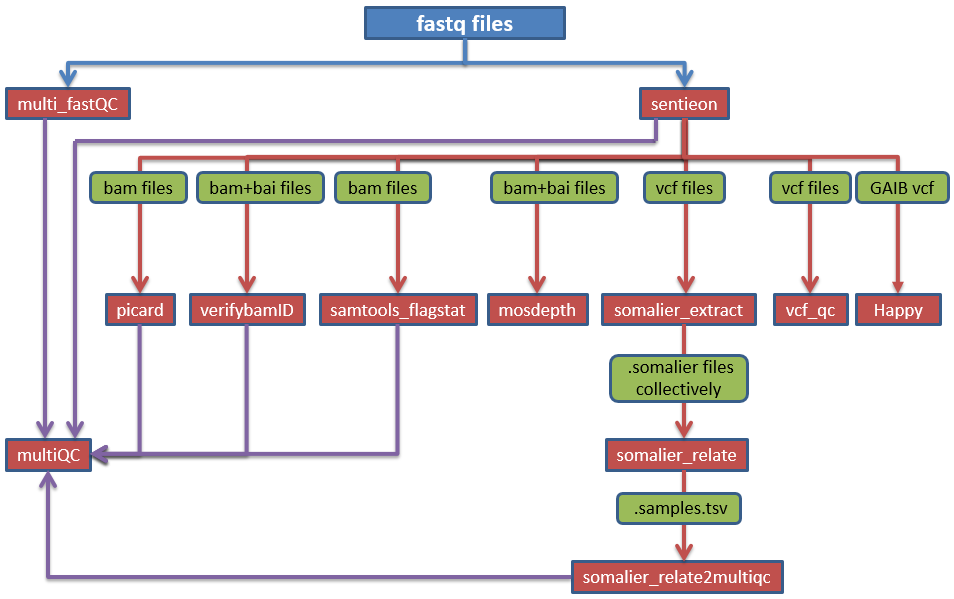

# dias_nextflow

At the moment, configuration of Dias into nextflow is mainly based on CEN assay; therefore, some reference files need to be replaced in the command line if to run TWE assay.
In the future, this will be improved so that the correct ref will be called based on the assay.

Current nextflow dias has the following app 
 - multi_fastQC
 - sentieon
 - picard
 - verifybamiD
 - samtools_flagstat
 - somalier_extract
 - somalier_relate
 - somalier_relate2multiqc
 - multiQC
 - mosdepth
 - vcf_qc
 
### nextflow.config
Contains all parameters used in different processes
### main.nf
Contains all processes and worflows to run
### bin folder
Contains all the source codes/tools

### To build nextflow_dias on DNAnexus
```
 git clone <repo>
 dx select <DNAnexus project>
 dx build --nextflow (inside the cloned folder)
 ```
 
### To run the built nextflow applet on DNAnexus 
```
dx run applet-xxxx \
-idocker_creds=file-xxxx \
-i nextflow_pipeline_params="--file_path="dx://project-xxxx:/""
```
 
`docker_creds file` is `.json` file and to be created with docker user name and token as described [here](https://documentation.dnanexus.com/user/running-apps-and-workflows/running-nextflow-pipelines#private-docker-repository). Docker crendential file is to be saved in private DNAnexus project \
`--file_path` is the dir where the all fastq files are located on DNAnexus 


## How the pipeline works
The pipeline takes multiple samples (i.e fastq.gz files) as initial input, and all fastq files inside `--file_path` are run in parallel. The ouputs from one process feed into relevant subsequent processes. Therefore, one set off will run all samples in series of processes. 

